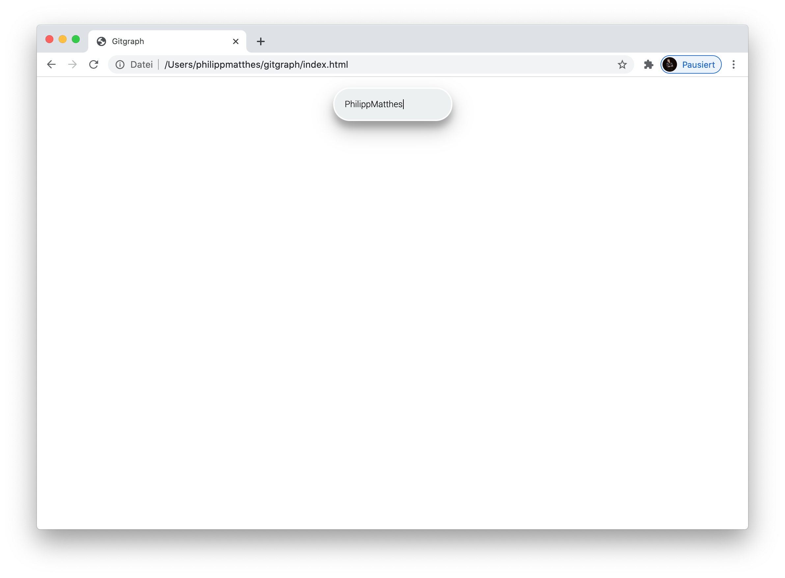
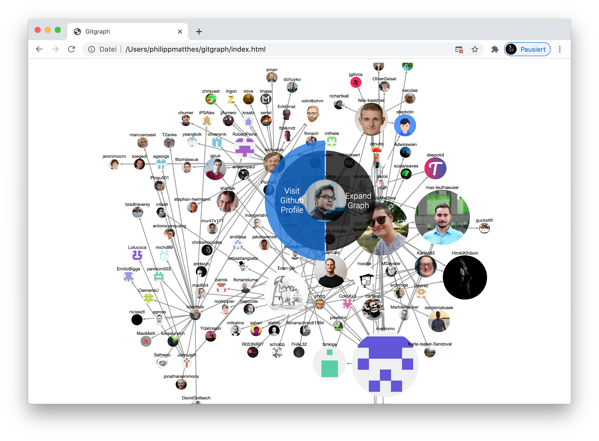

# Gitgraph
A tool to explore Github cliques.

## Usage

Visit <a href="https://philippmatthes.github.io/Gitgraph/index.html">the static website</a> and enter a Github username to start with:

If the Github username was valid, you should see the first node of the graph, which represents the Github profile behind this username. Now you have the following possibilities:

- Left click on nodes to load the followers of this Github user into the graph. You will see, that nodes adjust their sizes according to their incoming edges. These users in particular are followed by many of the users you selected.
- Right click and hold on nodes to choose between expanding the graph (same as left click) or visit the associated Github profile.

Note that results are limited to 100 followed profiles.
