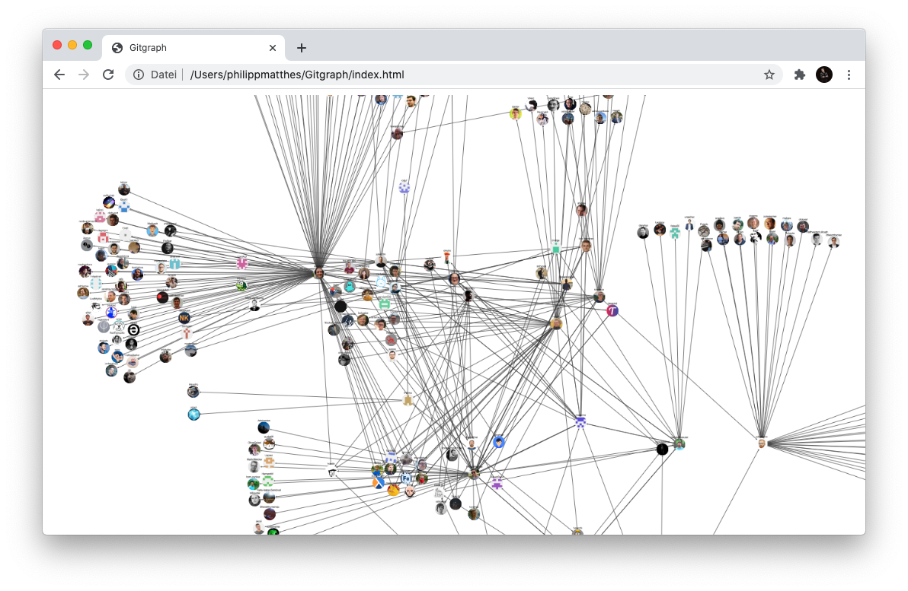

# Gitgraph
A tool to explore your Github friends

## Usage

0. Visit <a href="https://philippmatthes.github.io/Gitgraph/index.html">the static website</a>.
1. Create a personal access token
2. Paste it into the field and press return
3. Click on your profile to load all users you follow.
4. Repeat from 3 to explore all of your followers.

Note that results are limited to 100 followed profiles.
